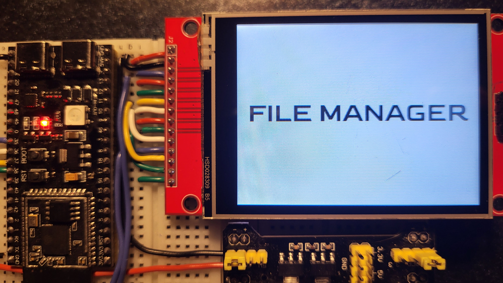

# ESP32 File Manager

LVGL-based file manager for ESP32 and ESP32-S3, enabling seamless file navigation and management. It provides reliable SD card browsing, text editing, image viewing, persistent settings, and time synchronization on a lightweight MCU platform. Designed as a robust, stateful embedded application, not a demo.

## Highlights
- SD navigation with `paged lists`, `sorting` (Name/Date/Size, asc/desc), and `persisted` last path + sort mode in NVS.
- `File and folder actions`: create folder, create TXT, rename, delete, copy/move with clipboard and Paste/Cancel, size confirmation on copy, conflict resolution (overwrite or “keep both” via rename).
- `Text viewer/editor`:  
   - Read-only by default, edit view for editing
   - Atomic saves (temp file + rename)
   - Chunked read/write (1 KB per chunk) with slider for large files
   - Save/discard prompts and automatic resume after SD reconnect
- `JPEG image viewer` for `.jpg/.jpeg`, specific prompts for corrupted/unsupported images, oversized resolution ( > 2560X1920), or low memory. Other image extensions get an icon in the list.
- `Settings UI`: 
   - Brightness with fade
   - Screensaver with off and dim timers, `Light-sleep power saving` when the screensaver turns the display off
   - Dark/light theme
   - Manual or `SNTP` date and time
   - 4-step rotation
   - Touch screen calibration
   - Restart and reset to defaults.
   - ; the touch IRQ wakes the UI and logs are flushed before sleep so the entry message is visible.
- `Time and network`: 
   - Wi‑Fi STA with SSID/password stored in NVS
   - SNTP sync via `pool.ntp.org`
   - Default timezone (`SNTP_DEFAULT_TIMEZONE` in `components/sntp_wifi/include/sntp_header.h`)
   - Time persisted across soft restarts
- `SD robustness`:
   - Clean SDSPI mount/unmount
   - On-screen retry dialog on failure
   - Helper task blocks UI flow until reconnection
- Optional `heap logging task` when CONFIG_APP_ENABLE_HEAP_STATS is enabled.

## Prototype


## GPIO & SPI Configuration
The project uses three SPI-based peripherals:
1. Display - ILI9341 
2. Touch - XPT2046 
3. SD card  - SDSPI formatted as FAT/FAT32

GPIOs and SPI parameters are configured via:
- sdkconfig.defaults
- `sdkconfig.defaults.esp32`
- `sdkconfig.defaults.esp32s3`  
- or directly in `idf.py menuconfig`

It is very hard to miss, as it is `the first section inside any sdkconfig`. 

The touch IRQ pin selected through `CONFIG_TOUCH_IRQ_GPIO` also acts as the EXT0 wakeup source for the screensaver light sleep, so keep it on an RTC-capable GPIO (ESP32: GPIO0,2,4,12-15,25-27,32-39).

### Important SD stability note:

Lower CONFIG_SDSPI_MAX_FREQ_KHZ to ≤ 5–10 MHz if you experience SD init or runtime issues.  
Short wires, proper pull-ups (especially on SD CS), and clean power are critical.  
The default is 20MHz, this speed is decent but it is stable only with short wires ( < 5cm) and with CS pullup. 

Display + touch share one SPI bus; SD uses a separate bus. Avoid changing SPI host assignments unless you know exactly what you are doing.

## User Interface Overview
### File Manager
- Header with Settings, Set Date & Time, and Tools menu
- Tools: `New Folder`, `New TXT`, `Sort`.
- Paged listing for large folders.
- Item actions dialog: `Edit` (TXT only), `Rename`, `Delete`, `Copy`, `Cut`, `Cancel`.
- Clipboard buttons appear only when relevant
- Folder tap navigates, `.txt` opens text viewer; `.jpg/.jpeg` opens image viewer.

### Text Editor
- Viewer by default; edit mode via action or new file creation
- On-screen keyboard
- Dirty-state tracking with save/discard prompts
- Atomic save and safe close behavior
- Auto-resume after SD reconnect

### JPEG Viewer
- Dedicated full-screen viewer for `.jpg/.jpeg`
- Clear error feedback for unsupported or problematic images

### Settings
- Brightness, rotation, screensaver timers persisted in NVS
- Theme switch (restart required)
- Wi-Fi + SNTP dialog and manual date/time editor
- Clock status indicator in the file manager header
- Touch calibration with optional startup prompt
- Reset to defaults (calibration prompt, screensaver, brightness, rotation, theme, Wi‑Fi, date/time).


## Runtime flow
- Boot: init NVS, start display and styles, load settings from NVS, show splash on power-on, optional auto-SNTP, init/register touch, load or run calibration.
- SD: `sd_card_init` mounts `/sdcard`; on failure a retry dialog appears and the wait task blocks until reconnection.
- UI: file manager screen loads and screensaver timers start. If `CONFIG_APP_ENABLE_HEAP_STATS` is enabled, a heap logging task runs at ~100 ms.

## Hardware
- MCU: ESP32 or ESP32-S3, 4 MB flash (see `partitions_modified.csv`).
- Display: ILI9341 320x240 over SPI, mainly controlled via `lvgl`, `esp_lvgl_port` and `esp_bsp`.
- Touch: XPT2046 over SPI.
- Storage: microSD on SDSPI (FAT).

## Software Dependencies
- ESP-IDF: 5.5.0 (or compatible)
- LVGL: 9.4.0 via `espressif/esp_lvgl_port`
- Display driver: `espressif/esp_lcd_ili9341`
- Touch driver: `atanisoft/esp_lcd_touch_xpt2046`
- Python + CMake/Ninja (bundled with ESP-IDF)

## Configure
1. Install ESP-IDF.
2. Select target:
   ```sh
   idf.py set-target esp32s3
   ```
   or

   ```sh
   idf.py set-target esp32
   ```
3. Open configuration:
   ```sh
   idf.py menuconfig
   ``` 
   Adjust:
   - SD Card configuration (GPIOs, SDSPI speed)
   - Display / Touch pins and rotation
   - App Settings → enable heap stats (optional)
   - Timezone for SNTP: change `SNTP_DEFAULT_TIMEZONE` in `components/sntp_wifi/include/sntp_header.h` if you are not in EET/EEST.

The repository ships with ready-to-use sdkconfig.defaults files to minimize setup friction.

## Build and flash
```sh
idf.py build
idf.py -p COMx flash monitor
```
Replace `COMx` with your serial port. Partitions are defined in `partitions_modified.csv` (app ~3 MB, NVS 0x6000).


## Project layout
- `main/` – `app_main`, main task, optional heap stats task.
- `components/file_manager/` – LVGL file UI, `fs_navigator`, `text ops`, `text viewer/editor`.
- `components/image_viewer/` – JPEG viewer.
- `components/settings/` – settings UI.
- `components/sd_card/` – SDSPI init, mount/remount with retry overlay.
- `components/sntp_wifi/` – Wi‑Fi STA + SNTP (default timezone, `pool.ntp.org`).
- `components/touch_xpt2046/` – touch driver and calibration helpers.
- `components/styles/`, `components/fonts/` – LVGL theme and custom fonts.
- `third_party/esp_bsp_generic/` – generic BSP for SPI panel; 
- `third_party/lvgl/` – lvgl repo; 
- `managed_components/` – Component Manager deps.

## Troubleshooting
- SD won’t mount: check wiring, SDSPI speed, power, and format (FAT/FAT32).
- Wi-Fi / SNTP fails: verify SSID/password in settings; WPA2-PSK or open networks supported.
- Touch drift: rerun calibration or erase flash to force calibration at boot.
- Out of memory: reduce LVGL draw buffer size.
- Heap pressure: toggle `CONFIG_APP_ENABLE_HEAP_STATS` for visibility and inspect logs. Lowering `CONFIG_BSP_LCD_DRAW_BUF_HEIGHT`, and turning off `CONFIG_LV_ATTRIBUTE_FAST_MEM_USE_IRAM` and `CONFIG_BSP_LCD_DRAW_BUF_DOUBLE` have the biggest impact on the heap, but they also affect smoothness and FPS.

## License
MIT License (see `LICENSE`).
